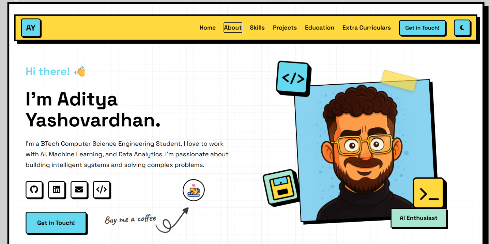

<div align="center">

# 🚀 Aditya Yashovardhan — Portfolio

**A neo-brutalist, interactive personal portfolio built with vanilla HTML, CSS & JavaScript.**

[](https://adityayashovardhan.me)
[](./LICENSE)
[](https://developer.mozilla.org/en-US/docs/Web/HTML)
[](https://developer.mozilla.org/en-US/docs/Web/CSS)
[](https://developer.mozilla.org/en-US/docs/Web/JavaScript)

<br/>



</div>

---

## 📋 Table of Contents

- [About](#-about)
- [Key Features](#-key-features)
- [Tech Stack](#-tech-stack)
- [Project Structure](#-project-structure)
- [Getting Started](#-getting-started)
- [Sections Overview](#-sections-overview)
- [Performance & SEO](#-performance--seo)
- [License](#-license)
- [Contact](#-contact)

---

## 🧑‍💻 About

Hi! I'm **Aditya Yashovardhan** — a B.Tech Computer Science Engineering student at **MPSTME, NMIMS University** with a deep passion for **AI, Machine Learning, and Data Analytics**. This portfolio showcases my projects, skills, education, and extracurricular involvement through a visually striking, interaction-rich web experience.

---

## ✨ Key Features

| Feature | Description |
|---|---|
| **Neo-Brutalist Design** | Bold typography, thick borders, vivid accent colors, and hand-crafted SVG decorations for a distinctive aesthetic |
| **Dark / Light Theme** | One-click toggle with persistent `localStorage` preference |
| **Animated Loading Screen** | Custom SVG shape animations with a progress bar and monogram reveal |
| **Matrix Typing Effect** | Character-scramble hero greeting inspired by the "Matrix rain" effect |
| **Scroll-Driven Animations** | Paper-tear parallax, highlight underline reveals, and book-page flip for the timeline section |
| **Interactive Journey Map** | Leaflet.js powered watercolor-style map with neo-brutalist markers linking to timeline entries |
| **Progress Bar Navigation** | Horizontal checkpoint bar tracking scroll position across all sections |
| **Treasure Map Easter Egg** | Hand-drawn SVG treasure map on the back of the experience timeline (book-flip reveal) |
| **Responsive Layout** | Fully responsive from mobile to ultra-wide — navbar, grids, and map adapt gracefully |
| **SEO Optimized** | JSON-LD structured data, Open Graph & Twitter cards, canonical URL, sitemap, and robots.txt |

---

## 🛠 Tech Stack

<div align="center">

| Layer | Technology |
|---|---|
| **Structure** | HTML5 with semantic elements |
| **Styling** | Vanilla CSS — custom properties, keyframe animations, glassmorphism |
| **Logic** | Vanilla JavaScript — Intersection Observer, scroll listeners, `localStorage` |
| **Map** | [Leaflet.js](https://leafletjs.com/) with Stamen Watercolor tiles |
| **Icons** | [Font Awesome 6](https://fontawesome.com/) |
| **Fonts** | [Space Grotesk](https://fonts.google.com/specimen/Space+Grotesk), [Space Mono](https://fonts.google.com/specimen/Space+Mono), [Caveat](https://fonts.google.com/specimen/Caveat) |
| **Hosting** | GitHub Pages with custom domain |

</div>

> **Zero build step. Zero frameworks. Zero dependencies (except Leaflet & Font Awesome via CDN).**

---

## 📁 Project Structure

```
Aditya-s-Portfolio/
├── index.html              # Main portfolio page
├── terminal.html           # Interactive terminal easter egg
├── neo-styles.css          # Primary stylesheet (design system + components)
├── styles.css              # Supplementary / legacy styles
├── script.js               # Additional JavaScript logic
├── favicon.svg             # SVG favicon
├── CNAME                   # Custom domain configuration
├── robots.txt              # Search engine crawling rules
├── sitemap.xml             # Sitemap for SEO
├── .nojekyll               # Bypass Jekyll processing on GitHub Pages
├── LICENSE                 # Proprietary license
├── image/
│   ├── avatar-gpt.png      # Hero avatar
│   ├── social-cover.png    # OG / social media preview image
│   ├── favicon_ay.png      # PNG favicon
│   ├── arrow.png           # Decorative arrow graphic
│   ├── caffe-icon.gif      # Coffee button animation
│   ├── pirat.png           # Pirate overlay for the map
│   └── lazyfire-logo.svg   # Project logo
└── *.py                    # Build / utility scripts (section ordering, search indexing)
```

---

## 🚀 Getting Started

Since this is a **static site with no build step**, getting it running locally is trivial:

### 1. Clone the repository

```bash
git clone https://github.com/Adityya21/Aditya-s-Portfolio.git
cd Aditya-s-Portfolio
```

### 2. Serve locally

Use any static file server. For example:

```bash
# Python 3
python -m http.server 8000

# Node.js (npx)
npx serve .

# VS Code
# Install the "Live Server" extension and click "Go Live"
```

### 3. Open in browser

Navigate to `http://localhost:8000` (or the port shown by your server).

---

## 📖 Sections Overview

| # | Section | Highlights |
|---|---|---|
| 1 | **Hero** | Animated greeting, avatar with tilt-on-scroll, falling SVG decorations, tech badge ticker |
| 2 | **About** | Scroll-driven highlight underlines, personal narrative |
| 3 | **Skills** | Categorized skill grid — Languages, Frameworks, Tools, LLMs, Coursework, Soft Skills |
| 4 | **Projects** | Featured project cards with GitHub links |
| 5 | **Education** | Timeline cards with institution and year badges |
| 6 | **Certifications** | Google Data Analytics Certificate with credential link |
| 7 | **Extra Curriculars** | Book-page flip timeline + interactive Leaflet journey map |
| 8 | **Contact** | LinkedIn, GitHub, Email, LeetCode quick links |

---

## ⚡ Performance & SEO

- **Preconnect & Preload** — Critical fonts and stylesheets are preloaded for faster first paint
- **Lazy Loading** — Non-critical images use `loading="lazy"`; Font Awesome loaded via `media="print"` swap
- **Semantic HTML** — Proper heading hierarchy, landmark elements, accessible labels
- **Structured Data** — JSON-LD `Person` schema for rich search results
- **Open Graph + Twitter Cards** — Optimized social sharing previews
- **Sitemap & Robots.txt** — Full crawlability control for search engines

---

## 📜 License

This project is under a **Proprietary License**. See [LICENSE](./LICENSE) for details.

> © 2026 Aditya Yashovardhan. All rights reserved. No part of this codebase may be reproduced, distributed, or modified without prior written permission.

---

## 📬 Contact

<div align="center">

[](https://www.linkedin.com/in/aditya-yashovardhan-859276296/)
[](https://github.com/Adityya21/)
[](mailto:aditya.yashovardhan21@gmail.com)
[](https://leetcode.com/u/fvgKStlmkk/)
[](https://adityayashovardhan.me)

</div>

---

<div align="center">

**Built with ❤️ by Aditya Yashovardhan**

*If you found this inspiring, consider giving it a ⭐!*

</div>
